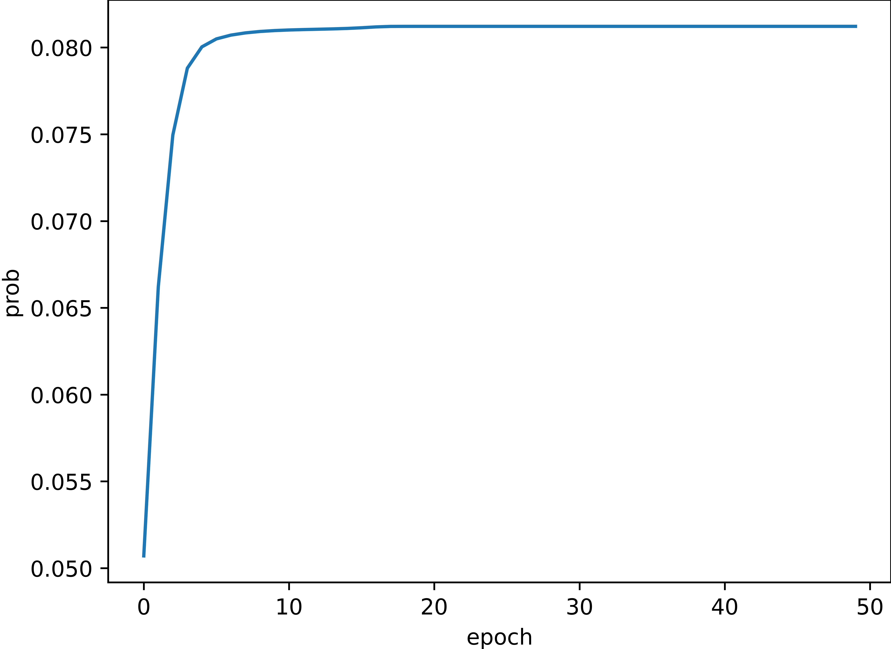

# 运行环境
- python 3.8
- numpy 1.19.1
# HMM 实现
假设观测变量为 X, 隐变量为 Y,模型参数为 d.这里实现了HMM 的以下问题的求解
- p(X;d) 
	- 前向算法 calculate_prob_forward
	- 后向算法 calculate_prob_backward
- argmax_{Y} p(Y|X;d)
	- decoding 动态规划解法
	- force_decoding 暴力解法
	- 暴力解法主要为了验证动态规划的正确性
- argmax_{d} p(X;d)
	- baum_welch_one_step EM算法进行参数优化
	- 为了验证 参数优化算法的正确性,这里使用了一个数据序列s不断优化HMM模型,然后可以
发现,该条数据序列的p(X;d) 的概率不断增加,这和参数优化的优化目标是一致的,验证了优化算法的正确性

其中 A 为转移矩阵, B 为发射矩阵, pi 为初始的隐状态分布
# 存在的问题
- 拟合序列太长,效果会变得很差,
# 参考
- https://www.bilibili.com/video/BV1MW41167Rf?p=6
- https://zhuanlan.zhihu.com/p/85454896
